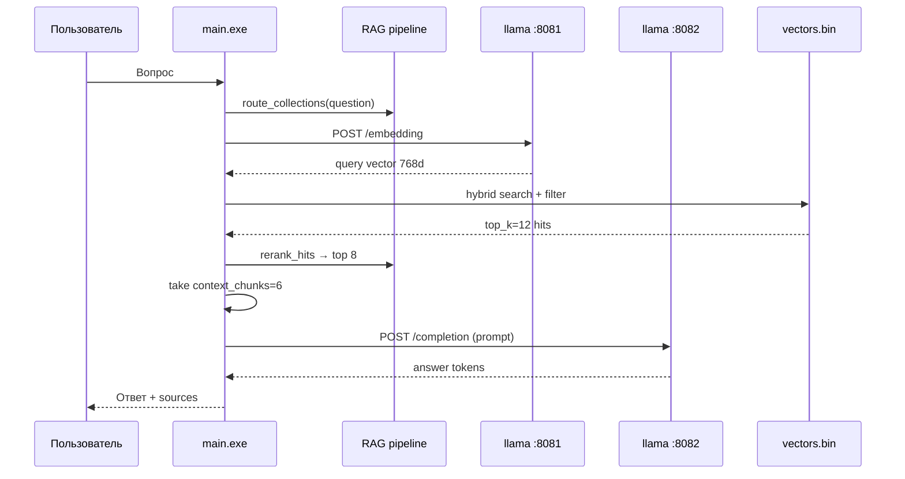

# COMPACS RAG Desktop — архитектурный план

Версия: hybrid_dense_3b_cpu (июль 2026). Офлайн Windows, без Python/Ollama/Docker.

---

## 1. Общая схема

```text
┌─────────────────────────────────────────────────────────────────────────┐
│  Пользователь                                                           │
│    • Консоль: main.exe --console  (рекомендуется)                       │
│    • WebView UI: main.exe         (опционально, :8765)                  │
└───────────────────────────────┬─────────────────────────────────────────┘
                                │
                                ▼
┌─────────────────────────────────────────────────────────────────────────┐
│  main.exe (C++)                                                         │
│  ┌─────────────┐  ┌──────────────┐  ┌─────────────┐  ┌──────────────┐  │
│  │ config.yaml │  │ vectors.bin  │  │ lemma_map   │  │ RagController│  │
│  │ AppConfig   │  │ COMPACS1     │  │ .tsv        │  │              │  │
│  │ 2272×768d   │  │ 2272 chunks  │  │ ~7k forms   │  │              │  │
│  └─────────────┘  └──────────────┘  └─────────────┘  └──────┬───────┘  │
└───────────────────────────────────────────────────────────────┼─────────┘
                                                                │
                    ┌───────────────────────────────────────────┘
                    ▼
┌─────────────────────────────────────────────────────────────────────────┐
│  RAG pipeline (rag_pipeline.hpp + hybrid_search.hpp)                    │
│                                                                         │
│  Вопрос                                                                 │
│    → [1] Collection routing (1_OG / 2_OG / 3_OG по ключевым словам)     │
│    → [2] Embed запроса (:8081, nomic-embed-text, 768d)                 │
│    → [3] Hybrid retrieve: Dense + BM25 + RRF (pool top_k=12)           │
│         • веса: dense 0.65 / BM25 0.20 / RRF 0.15                       │
│         • лемматизация + cross-forms (запустить→запуск)                 │
│         • section-boost для §7.1, §8.1 и т.д.                           │
│    → [4] Lexical rerank (similarity×0.6 + overlap×0.4) → top 8          │
│    → [5] Map-Reduce (опционально, по умолчанию OFF на CPU)              │
│    → [6] Prompt: 6 чанков × 800 символов + Llama 3 chat template        │
│    → [7] Generation (:8082, llama3.2-3b-instruct, num_predict=250)      │
│                                                                         │
│  Ответ + источники (файл, страница)                                     │
└─────────────────────────────────────────────────────────────────────────┘
                    │                              │
                    ▼                              ▼
         llama-server :8081              llama-server :8082
         nomic-embed-text.gguf           llama3.2-3b-instruct.gguf
         /embedding                      /completion
```

---

## 2. Компоненты

| Компонент | Файл / сервис | Назначение |
|-----------|---------------|------------|
| **Индекс** | `vectors.bin` | 2272 чанка, 768d float32, magic COMPACS1. Экспорт из стенда `vectors_ollama768` |
| **Леммы** | `lemma_map.tsv` | Нормализация русских форм для BM25 и запроса |
| **Hybrid search** | `hybrid_search.hpp` | Dense cosine + BM25 + RRF + section boost |
| **Rerank** | `rag_pipeline.hpp` | Лексический rerank поверх hybrid pool |
| **Router** | `rag_pipeline.hpp` | Фильтр по частям OG: `1_OG_1`, `2_OG_1`, `3_OG_1` |
| **Конфиг** | `config.yaml` | Профиль `hybrid_dense_3b_cpu` |
| **Embed** | llama :8081 | `nomic-embed-text.gguf` |
| **Chat** | llama :8082 | `llama3.2-3b-instruct-q4_K_M.gguf`, ctx=16384 |

---

## 3. Поток одного запроса



---

## 4. Параметры профиля (config.yaml)

| Параметр | Значение | Смысл |
|----------|----------|-------|
| `top_k` | 12 | Пул после hybrid |
| `rerank_top_k` | 8 | После rerank |
| `context_chunks` | 6 | В промпт |
| `chunk_chars` | 800 | Обрезка чанка |
| `similarity_threshold` | 0.30 | Cosine distance (меньше = строже) |
| `hybrid_enabled` | true | Dense+BM25+RRF |
| `rerank_enabled` | true | Лексический rerank |
| `collection_routing_enabled` | true | Фильтр по частям OG |
| `map_reduce_enabled` | **false** | Выключен (CPU latency) |
| `num_ctx` | 16384 | Контекст llama-server -c |
| `num_predict` | 250 | Макс. токенов ответа |

---

## 5. Источники документации в индексе

| Префикс source | Содержание |
|----------------|------------|
| `1_OG_1` | Часть 1: терминал, монитор, установка, §7–8 |
| `2_OG_1` | Часть 2: графики, спектры, анализ |
| `3_OG_1` | Часть 3: приборы, синхронизация, конфигурация |

---

## 6. Качество (бенчмарк 4 вопроса, июль 2026)

| Вопрос | Качество | Примечание |
|--------|----------|------------|
| Экран Монитор | **81%** | p.86 в контексте ✓ |
| Запуск терминала | **9%** | p.63 не в top — доработка retrieval |
| Синхронизация прибора | **78%** | p.91 ✓ |
| Панель адреса субъекта | **54%** | Слабый retrieval |
| **Среднее** | **55%** | См. `qa_evaluation.json` |

Метрика: `retrieval×0.35 + answer×0.65` (dev: `tools/eval/run_qa_eval.py`).

---

## 7. Сравнение со стендом (Python)

| Аспект | Стенд | Desktop |
|--------|-------|---------|
| Embed | nomic-embed-text | Тот же GGUF, те же 768d векторы |
| Индекс | ClickHouse / JSON | `vectors.bin` COMPACS1 (bit-exact) |
| Retrieval | Hybrid + rerank | Hybrid + rerank + lemmas + router |
| LLM | Ollama / OpenAI | llama3.2-3b local |
| Коллекции | `data/collections/` | Router по `N_OG_1` в source |
| API | FastAPI :3080 | Локально :8765 (опционально) |

---

## 8. Режимы запуска

| Команда | Описание |
|---------|----------|
| `START.cmd` | llama + **консоль** `main.exe --console` (прямой RAG) |
| `START_UI.cmd` | llama + WebView UI (:8765) |
| `main.exe -q "вопрос"` | Один вопрос в консоль |
| `python tools/eval/run_qa_eval.py` | Golden Set без UI (только :8081/:8082; Python не в runtime) |

---

## 9. Порты (localhost)

| Порт | Сервис |
|------|--------|
| 8081 | llama embed |
| 8082 | llama chat |
| 8765 | UI/API main.exe (только START_UI) |

Конфликта со стендом (:8080, :3080) нет.

---

## 10. План улучшений

1. **Терминал §7.1** — доработать retrieval (p.63 в top-8): resplit секций, усилить lemma/router.
2. **Latency** — map-reduce off; при необходимости `context_chunks: 5`, `chunk_chars: 700`.
3. **Качество 70%+** — цель после фикса terminal + panel retrieval.
